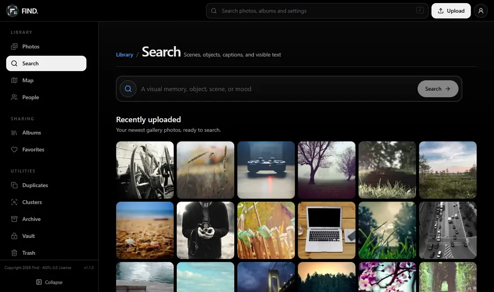
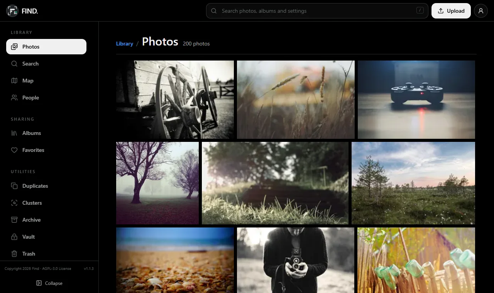
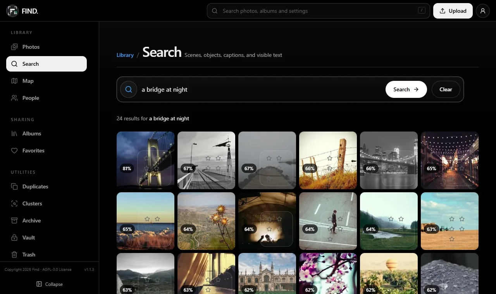
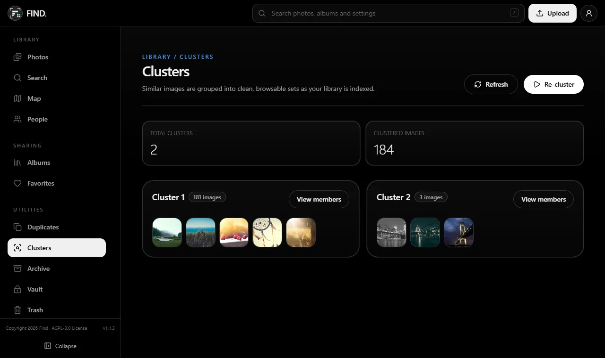
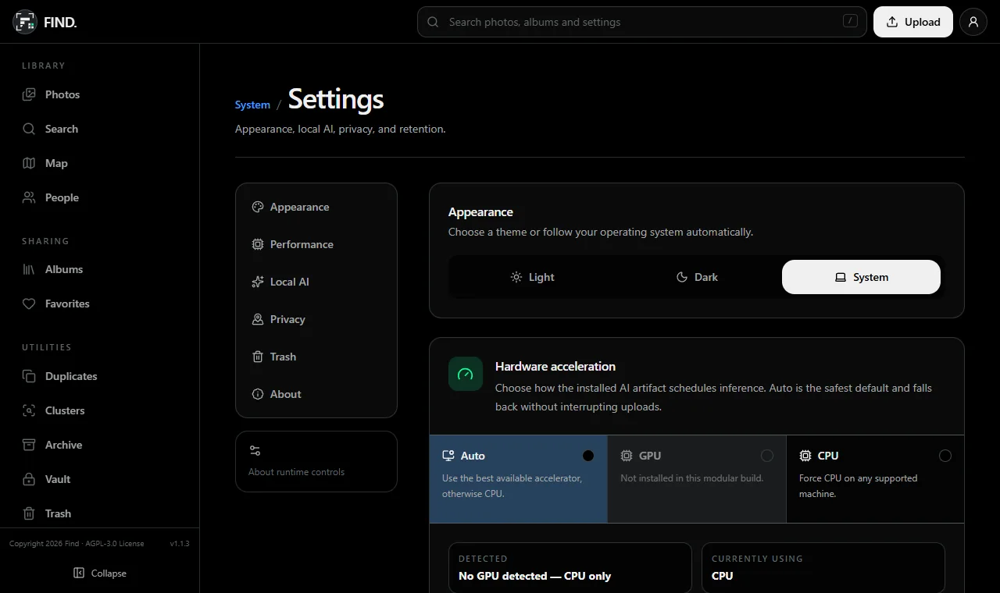
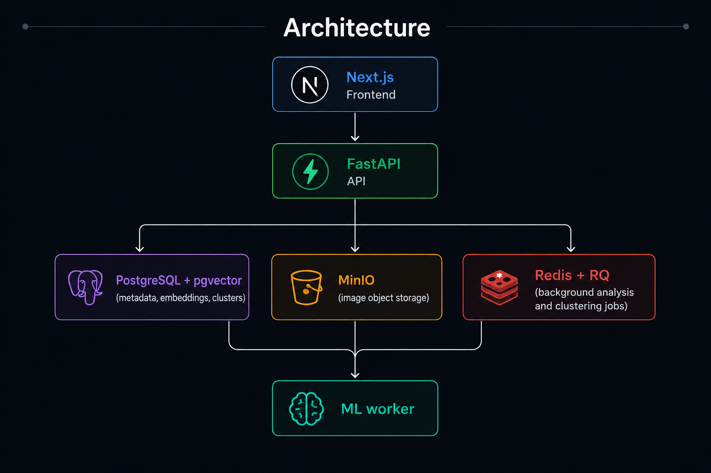
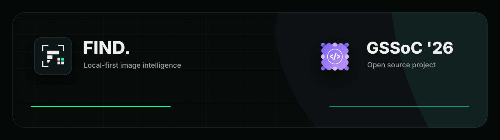
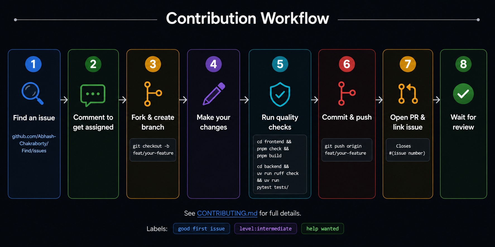

# Find

**Search your own photo library by describing what is in it.** Find is a self-hosted photo app that captions, tags, reads and groups your pictures on your own machine, then lets you search them in plain language. Nothing is sent to a cloud service.

<p align="center">
  
</p>

<p align="center">
  <a href="https://gssoc.girlscript.org/"></a>
  <a href="https://github.com/Abhash-Chakraborty/Find/actions/workflows/ci.yml"></a>
  <a href="https://github.com/Abhash-Chakraborty/Find/releases/latest"></a>
  <a href="https://github.com/Abhash-Chakraborty/Find/labels/good%20first%20issue"></a>
  <a href="https://github.com/Abhash-Chakraborty/Find/issues"></a>
  <a href="./LICENSE"></a>
</p>

<p align="center">
  <a href="#quick-start">Quick start</a> ·
  <a href="#how-search-works">How search works</a> ·
  <a href="#hardware-by-setup">Hardware</a> ·
  <a href="./docs/index.md">Docs</a> ·
  <a href="./GSSOC_CONTRIBUTOR_GUIDE.md">Contribute</a>
</p>

## Why Find

Cloud photo search works by uploading your whole library to someone else. Find gives you the same kind of search (by scene, object, text in the image or face) with every model running inside your own Docker stack. It runs on an NVIDIA GPU, on an ordinary laptop CPU, or with AI switched off entirely. Remote inference is fail-closed: if it is selected, Find refuses to send media anywhere rather than quietly falling back.

The demo above is a real recording of the CPU profile, searching 200 photos from [Unsplash](https://unsplash.com/license) (via [Lorem Picsum](https://picsum.photos)).

## What it does

- Upload individual images or ZIP archives
- Extract captions, detected objects, OCR text, EXIF metadata, and dimensions
- Generate hybrid embeddings for semantic search
- Automatically cluster related images after indexing completes
- Browse a virtualized timeline, gallery, albums, people, and clusters
- Inspect full-resolution images with zoom, keyboard navigation, and slideshow
- Share albums with scoped links and optional passwords/download controls
- Organize media with favorites, archive, recoverable trash, and near-duplicate review
- Protect hidden images in a password-gated private vault with recovery, configurable auto-lock, timeline browsing, preview, and restore controls. Image bytes remain in private object storage rather than being re-encrypted.
- Record local feedback for search, captions, objects, and people grouping

The [Features Guide](docs/guides/features.md) walks through each screen.

<table>
  <tr>
    <td width="50%"></td>
    <td width="50%"></td>
  </tr>
  <tr>
    <td align="center">Photos timeline</td>
    <td align="center">Search</td>
  </tr>
  <tr>
    <td width="50%"></td>
    <td width="50%"></td>
  </tr>
  <tr>
    <td align="center">Clusters</td>
    <td align="center">AI runtime settings</td>
  </tr>
</table>

## How search works

Every photo goes through the same pipeline once, when it is uploaded. Searching is then a single vector lookup.

1. **Ingest.** The API (`/api/upload`, or `/api/upload/bulk` for a ZIP) checks the file, stores the original in MinIO, creates a `media` row in PostgreSQL, and queues an analysis job on Redis (RQ, `high`/`default`/`low` queues).
2. **Analyse.** A worker picks up the job, reads EXIF and dimensions, makes a thumbnail, then runs the models:
   - **YOLO26 nano** for objects
   - **BLIP** for a caption
   - **PaddleOCR (PP-OCRv5)** for text in the image
   - **InsightFace** for faces, grouped into people
   - **SigLIP** (ViT-B-16 via `open-clip`) for embeddings
3. **Embed.** The stored vector is a weighted average of SigLIP embeddings of the image itself, its caption, its object labels and, when there is any, its OCR text (`generate_hybrid_embedding` in `backend/src/find_api/workers/processors.py`). Every signal lives in the same 768-dimensional space, so a sentence can match a picture.
4. **Index.** The vector goes into a pgvector column with an HNSW index. Once indexing succeeds, HDBSCAN clustering is queued.
5. **Query.** A search embeds the text with the same SigLIP model, asks pgvector for the closest vectors by cosine similarity (`1 - (vector <=> query)`), drops anything below a 0.38 similarity threshold, then adds a small boost when query words also appear in the caption, the object labels or the OCR text (`backend/src/find_api/ml/search_ranking.py`). OCR matches count most, so "receipt" or "invoice" find documents.

**Measured, not assumed.** The HNSW index runs with pgvector's default settings. [`docs/research/hnsw-index-fidelity.md`](docs/research/hnsw-index-fidelity.md) checks that against exact search: on clustered synthetic 768-d corpora it returned recall@10 = 1.0 at 1k and 10k vectors, with a 1.52 ms median query at 10k (pgvector 0.8.4, PostgreSQL 16). On a near-uniform worst case, recall drops to 0.59 at 10k, which is why the doc also reports the neighbour margin. `backend/scripts/benchmark_hnsw_recall.py` reproduces every number. Per-stage CPU cost is in the [CPU runtime guide](docs/guides/cpu-runtime-profile.md).

## Architecture

<picture>
  <source media="(prefers-color-scheme: dark)" srcset="docs/assets/architecture-dark.png">
  <source media="(prefers-color-scheme: light)" srcset="docs/assets/architecture-light.png">
  
</picture>

## Tech stack

- **Frontend:** Next.js 16, React 19, React Query, Tailwind CSS, Biome
- **Backend:** FastAPI, SQLAlchemy, PostgreSQL + pgvector, Redis, RQ, MinIO
- **ML pipeline:** YOLO26 nano, BLIP image captioning, PaddleOCR, SigLIP (`open-clip`), InsightFace, HDBSCAN

## Hardware by setup

Pick a profile by what your machine has. They share one codebase and one database; only the backend image differs.

| Setup | Command | What runs | Backend image | Memory | Disk |
| --- | --- | --- | --- | --- | --- |
| **CPU AI** (start here) | `docker compose -f compose.cpu.yml up --build` | Real captions, OCR, objects, faces, embeddings, clustering | 3.6 GB | 6 GB for Docker minimum, 8 GB+ comfortable | 8 GB minimum, 12 GB+ comfortable |
| **NVIDIA AI** | `docker compose up --build` | Same models on CUDA | 12 GB | NVIDIA GPU, driver and the NVIDIA Container Toolkit | Image plus about 3.4 GB of model weights |
| **Mock** | `docker compose -f compose.mock.yml up --build` | Deterministic fake metadata and vectors, for UI/API work | 582 MB | No model memory | No model downloads |
| **No AI** | `docker compose -f compose.no-ai.yml up --build` | Thumbnails, EXIF, gallery, albums, vault, map. No search | 447 MB | No model memory | No model downloads |

- On the CPU profile, RAM is the limit, not cores. All five models loaded at once peak at 3.1 to 3.3 GB in the worker, before PostgreSQL, Redis, MinIO and the web app. On an 8 GB machine, expect swapping unless you run without the frontend container.
- On a 4-core laptop, one photo takes about 6.5 s on CPU. OCR and captioning are 91% of that. Search itself only embeds the query.
- Model weights (about 3.4 GB) download on first use and are cached in the `model_cache`, `paddlex_cache` and `insightface_cache` volumes.
- GPU memory use has not been benchmarked yet. If you measure it, a PR to [`docs/guides/hardware-acceleration.md`](docs/guides/hardware-acceleration.md) is welcome.

Figures come from [`docs/guides/cpu-runtime-profile.md`](docs/guides/cpu-runtime-profile.md), measured on 4 cores with 5.8 GB for Docker under WSL2. The GPU image size is indicative.

Selecting a profile is a build/deployment choice. Explicit profiles extend `compose.base.yml`, keeping application and data services centralized while each backend image installs only its selected dependency extra. The dashboard can enable or disable installed AI and choose Auto/GPU/CPU, but it cannot install missing packages into a running container.

## Quick start

Copy the environment template and fill in the values before starting anything:

```bash
git clone https://github.com/Abhash-Chakraborty/Find.git
cd Find
cp .env.example .env
# then edit .env — see the comments in .env.example for what each value does
```

Then start the profile that fits your machine (see [Hardware by setup](#hardware-by-setup)). The CPU profile works everywhere Docker does:

```bash
docker compose -f compose.cpu.yml up --build
```

Services:

- Frontend: `http://localhost:3000`
- Backend API: `http://localhost:8000` (interactive API docs at `http://localhost:8000/docs`)
- MinIO API: `http://localhost:9200`
- MinIO console: `http://localhost:9201`

Notes:

- The default `compose.yml` is the NVIDIA profile and expects NVIDIA GPU access.
- Copy `.env.example` to `.env` before startup. Compose intentionally has no embedded service-password fallback.
- Release builds are published to GHCR with each [GitHub release](https://github.com/Abhash-Chakraborty/Find/releases): one web image and separate `no-ai`, `mock`, `cpu` and `nvidia` backend images.

### Fast contributor mode (recommended for most work)

For UI, API, upload, gallery, search, clustering, docs, and workflow changes, use the light stack:

```bash
docker compose -f compose.mock.yml up --build
```

This runs the same app flow with `ML_MODE=mock`, a Python slim backend image, and no GPU/model cache mount. It avoids downloading BLIP, SigLIP, PaddleOCR, YOLO, CUDA PyTorch, and related model weights, so first-time setup is much smaller and faster.

Light mode is deterministic but not AI-accurate:

- Uploads still go through MinIO, PostgreSQL, Redis, RQ, and the worker.
- The worker records image dimensions, EXIF, mock metadata, and schema-compatible vectors.
- Search and clustering exercise the same API/database paths using mock embeddings.
- Use the full stack before validating real ML quality or performance.

### Metadata only

For metadata-only operation with no AI dependencies or model downloads, use:

```bash
docker compose -f compose.no-ai.yml up --build
```

### Local development without Docker

#### Prerequisites

- Node.js 18+ and `pnpm`
- Python 3.12 and `uv`
- PostgreSQL with `pgvector`
- Redis
- MinIO (or S3-compatible storage)

#### 1. Clone and configure env

```bash
git clone https://github.com/Abhash-Chakraborty/Find.git
cd Find
cp .env.example .env
```

#### 2. Backend API

```bash
cd backend
uv sync --group dev
uv run uvicorn find_api.main:app --reload
```

Use `uv sync --group dev --extra cpu` for real CPU inference outside Docker, or
`uv sync --group dev --extra nvidia` for the locked CUDA build. The two extras
are intentionally mutually exclusive.

#### 3. Worker (separate terminal)

```bash
cd backend
uv run rq worker --url redis://localhost:6379 high default low
```

#### 4. Frontend (separate terminal)

```bash
cd frontend
pnpm install
pnpm dev
```

## Mock mode vs full ML mode

Find ships two runtime modes that serve different purposes. Choosing the wrong one is the most common source of contributor confusion.

### Mock mode (light stack)

```bash
docker compose -f compose.mock.yml up --build
```

`ML_MODE=mock` is set automatically. The worker skips all model loading and instead records:

| Field             | What you get                                                          |
| ----------------- | --------------------------------------------------------------------- |
| Caption           | A fixed placeholder string (e.g. `"mock caption"`)                    |
| Detected objects  | An empty list or a static stub                                        |
| OCR text          | An empty string                                                       |
| Embedding vector  | A zero-filled or seeded deterministic vector of the correct dimension |
| EXIF / dimensions | **Real values** extracted from the actual image file                  |

Because mock vectors have no semantic content, search results are meaningless — results may appear but their ranking is arbitrary and does not reflect real image similarity.

**Mock mode is the right choice when you are working on:**

- Frontend UI, layout, or styling
- API routing, request/response shapes, or error handling
- Upload, job-status polling, gallery, or delete/like flows
- Clustering pipeline logic (not cluster quality)
- Documentation, CI, or contributor-tooling changes

### Full ML mode (full stack)

```bash
docker compose -f compose.cpu.yml up --build   # or: docker compose up --build (NVIDIA)
```

The worker loads BLIP (captioning), YOLO26 nano (object detection), PaddleOCR (text extraction), InsightFace (faces), and SigLIP via `open-clip` (semantic embeddings). All metadata and vectors reflect real model output.

**Full ML mode is required when you are working on or reporting:**

- Caption quality or wording
- Search relevance — whether the right images appear for a query
- Object detection accuracy
- OCR output correctness
- Clustering quality (which images group together)
- Any ML model parameter or pipeline change

> ⚠️ **Do not report caption or search quality issues observed in mock mode.** Mock output is intentionally fake and will not reproduce in production. Always reproduce ML-quality claims in full mode before filing a bug.

### Quick reference

| Task                             | Use light stack? | Use full stack? |
| -------------------------------- | ---------------- | --------------- |
| UI fix or new component          | ✅ Yes           | Not needed      |
| API endpoint change              | ✅ Yes           | Not needed      |
| Upload / gallery / clusters flow | ✅ Yes           | Not needed      |
| Docs / CI / tooling              | ✅ Yes           | Not needed      |
| Caption looks wrong              | ❌ No            | ✅ Required     |
| Search returns bad results       | ❌ No            | ✅ Required     |
| OCR missed text                  | ❌ No            | ✅ Required     |
| ML pipeline performance          | ❌ No            | ✅ Required     |

First run of the full stack downloads BLIP, SigLIP, PaddleOCR, InsightFace, and YOLO weights (about 3.4 GB). Models are cached in Docker volumes and reused on subsequent runs.

## Controlling AI from the dashboard

The account/settings dashboard persists four instance-wide runtime choices:

- `ai_enabled` turns the installed AI pipeline on or off.
- `ml_mode` switches between the modes already present in the artifact. CPU and
  NVIDIA builds can move directly between disabled, mock, and full local AI;
  lightweight builds never pretend that missing model packages are available.
- `accel_mode` selects `auto`, `gpu`, or `cpu`; unsupported GPU requests fall
  back to CPU inside CPU/NVIDIA artifacts.
- `map_enabled` opts in to retaining GPS coordinates from EXIF for the private map.

Workers read all four values at the start of every job, so new jobs use the
saved choice without mutating a worker's process environment. Inspect
`GET /api/config/runtime` to compare the selected build/mode with the last state
actually applied by a worker. If that endpoint says `restart_required: true`,
start the CPU or NVIDIA compose artifact; a no-AI/mock image cannot become a
full image through a toggle.

`ML_MODE=remote` is intentionally fail-closed for now: no remote inference
adapter is installed, the runtime reports `unavailable`, and Find never sends
private media to a remote service or silently falls back to local models.

## Releases

Maintainers prepare patch, minor, or major semantic versions with one manual
workflow. The generated version PR lands in `canary`; the reviewed
`canary`-to-`main` promotion starts a three-hour quiet period before GitHub
creates the release and publishes immutable web plus separate `no-ai`, `mock`,
`cpu`, and `nvidia` backend images. Manual publish runs can still build one
selected profile without unrelated AI dependencies. See the
[changelog](CHANGELOG.md) for what each release contains.

## Local quality checks

### Frontend

```bash
cd frontend
pnpm check
pnpm build
```

### Backend

```bash
cd backend
uv run ruff check .
uv run ruff format --check .
uv run pytest tests/ -v
```

## ML troubleshooting

For debugging real caption generation, OCR extraction, embeddings, object detection, and semantic search quality issues, see:

- [Real ML Troubleshooting Guide](docs/guides/real-ml-troubleshooting.md)

The guide covers:

- Full ML mode vs mock mode
- Worker log inspection
- Caption/OCR debugging
- GPU and model-loading issues
- Manual validation workflows for search quality

## Core flow

1. Frontend uploads images to `/api/upload` or `/api/upload/bulk`.
2. Backend stores files in MinIO and creates `media` rows in PostgreSQL.
3. Uploads are queued through RQ.
4. Worker extracts metadata and generates embeddings.
5. Backend queues clustering once indexing succeeds.
6. Frontend polls job status and updates gallery/search/cluster views.

## Clustering prerequisites and expected behavior

Clustering only works on indexed images with generated embeddings. Images must complete the indexing pipeline successfully before they become eligible for clustering.

The current clustering pipeline requires at least `MIN_CLUSTER_SIZE` indexed images with embeddings before stable clusters can be formed. By default, the current minimum cluster size is `2`.

A clustering run may still complete successfully without producing any clusters. In those cases, the worker may return messages such as:

- `Not enough indexed images for clustering`
- `No stable clusters found`

`No stable clusters found` is a valid outcome and does not necessarily indicate a system failure. It can occur when the indexed dataset is too small or when images are not visually similar enough to form meaningful groups.

Repeated clustering attempts without adding or reindexing images are unlikely to produce different results and may unnecessarily consume worker resources.

## Key endpoints

The full, current list is the OpenAPI page the API serves at `http://localhost:8000/docs`. The ones you will meet first:

| Area | Endpoints |
| --- | --- |
| Upload | `POST /api/upload`, `POST /api/upload/bulk`, `GET /api/status/{job_id}` |
| Library | `GET /api/gallery`, `GET /api/timeline/buckets`, `GET /api/image/{media_id}`, `POST /api/image/{media_id}/like`, `POST /api/image/{media_id}/archive`, `POST /api/image/{media_id}/trash`, `POST /api/image/{media_id}/reprocess` |
| Search | `GET /api/search?q=...` |
| Clusters and people | `GET /api/clusters`, `GET /api/cluster/{cluster_id}`, `POST /api/cluster/run`, `GET /api/people` |
| Albums and sharing | `/api/albums`, `/api/shared-links`, `/api/partners` |
| Private vault | `/api/vault/*` |
| Runtime | `GET /api/config/runtime`, `GET /api/config/hardware`, `GET /api/status/models` |

## Configuration notes

`.env.example` reflects the current stack. Keep `EMBEDDING_DIM` aligned with the selected CLIP/SigLIP model and pgvector dimensions.

### Worker and clustering variables

| Variable             | Default | Description                                                                                                                                                                                    |
| -------------------- | ------- | ---------------------------------------------------------------------------------------------------------------------------------------------------------------------------------------------- |
| `WORKER_TIMEOUT`     | `600`   | Seconds before RQ kills a stalled job. Raise this when processing large batches or running real ML inference; the default is sufficient for mock mode.                                         |
| `MIN_CLUSTER_SIZE`   | `2`     | Minimum number of images HDBSCAN needs to form a cluster. Lower values produce more, smaller clusters; higher values produce fewer, broader ones. Tune after indexing a representative sample. |
| `MIN_SAMPLES`        | `1`     | Controls how conservative HDBSCAN is about noise. Higher values cause more images to be labelled unclustered (`-1`). Keep at `1` for small libraries.                                          |
| `CLUSTERING_BACKEND` | `auto`  | Clustering algorithm to use. `hdbscan` is the default and works well for variable-density image sets. Switch only if you are experimenting with an alternative backend.                        |

These only affect the worker and the `/api/cluster/run` path. Frontend and API behaviour is unchanged by them.

## Troubleshooting

- [Common Setup Errors](docs/guides/common-setup-errors.md)

### Images stuck in processing

When an image is marked as `processing`, the upload has been accepted and queued for background analysis by the worker. The worker reads the file from MinIO, extracts metadata, generates embeddings, updates the database row, and then queues clustering.

If an image looks stuck:

- Confirm the stack is running:

```bash
docker compose ps
```

- Inspect the worker logs first:

```bash
docker compose logs --tail=200 worker
```

- Check the API logs for upload, storage, or queue errors:

```bash
docker compose logs --tail=200 api
```

- Confirm Redis and MinIO are healthy in `docker compose ps`.
- Do not retry or manually reprocess while the image is still `processing`.
- Retry/reprocess only after the item has moved to `failed`.
- `WORKER_TIMEOUT` controls the analysis job timeout. After the recovery flow marks an abandoned item as `failed`, the existing retry/reprocess action can be used.

### Slow first run

- Model downloads happen on the first startup of the full stack, and the first photo waits for them.
- Cached models are stored in the `model_cache`, `paddlex_cache` and `insightface_cache` Docker volumes.
- Use `docker compose -f compose.mock.yml up --build` when you only need to test contributor changes without real ML inference.

### Docker disk usage

- The full GPU stack is intentionally large because it includes CUDA, PyTorch, OCR, and the real ML dependencies needed for local inference.
- Uploaded images live in MinIO, while model downloads live in `model_cache`. Docker build cache is separate from both.
- If repeated rebuilds make Docker grow too much, inspect usage with `docker system df -v`.
- To safely reclaim old build cache while keeping recent layers for faster rebuilds:

```bash
docker builder prune -f --reserved-space 10GB
```

- Older installs may also contain a stale `uv` package cache inside the `model_cache` volume. If present, it is safe to remove while keeping downloaded model files:

```bash
docker compose exec api sh -lc "rm -rf /root/.cache/uv"
```

- Prefer the light stack for routine UI/API/docs work when you do not need real inference:

```bash
docker compose -f compose.mock.yml up --build
```

## Contributors

Find is a community project. It was selected for **GirlScript Summer of Code 2026**, and most of its merged pull requests come from contributors outside the maintainer: features, fixes, tests, accessibility and docs. Thank you to everyone who has opened an issue, reviewed a change or sent a PR.

<a href="https://github.com/Abhash-Chakraborty/Find/graphs/contributors">
  
</a>

Created and maintained by [Abhash Chakraborty](https://github.com/Abhash-Chakraborty).

### GSSoC'26 contributors

This project is open for **GSSoC'26** contributions.

<p align="center">
  <picture>
    <source media="(prefers-color-scheme: dark)" srcset="docs/assets/gssoc-2026-banner-dark.svg">
    <source media="(prefers-color-scheme: light)" srcset="docs/assets/gssoc-2026-banner-light.svg">
    
  </picture>
</p>

- New contributors should start with the [GSSoC'26 Contributor Guide](./GSSOC_CONTRIBUTOR_GUIDE.md).
- For concise repo-aware contributor and coding-agent workflow guidance, start with [AGENTS.md](./AGENTS.md).
- Start with issues labeled [`good first issue`](https://github.com/Abhash-Chakraborty/Find/labels/good%20first%20issue)
- Beginner-friendly work may also use [`level:beginner`](https://github.com/Abhash-Chakraborty/Find/issues?q=state%3Aopen%20label%3A%22level%3Abeginner%22)
- For bigger work, check [`level:intermediate`](https://github.com/Abhash-Chakraborty/Find/issues?q=state%3Aopen%20label%3A%22level%3Aintermediate%22), [`level:advanced`](https://github.com/Abhash-Chakraborty/Find/issues?q=state%3Aopen%20label%3A%22level%3Aadvanced%22), and [`level:critical`](https://github.com/Abhash-Chakraborty/Find/issues?q=state%3Aopen%20label%3A%22level%3Acritical%22)
- Look for priority queue items via [`help wanted`](https://github.com/Abhash-Chakraborty/Find/labels/help%20wanted)
- Follow the contribution rules in [CONTRIBUTING.md](./CONTRIBUTING.md)

### Contribution quick start

1. Pick an issue and comment to get assigned.
2. Fork and create a branch from the default `canary` branch.
3. Make changes with focused commits.
4. Run quality checks from CONTRIBUTING.
5. Open a PR into `canary` using the project template and link the issue.

### Contribution workflow

<picture>
  <source media="(prefers-color-scheme: dark)" srcset="docs/assets/contribution-dark.png">
  <source media="(prefers-color-scheme: light)" srcset="docs/assets/contribution-light.png">
  
</picture>

See [CONTRIBUTING.md](./CONTRIBUTING.md) for full details.
Labels: [`good first issue`](https://github.com/Abhash-Chakraborty/Find/labels/good%20first%20issue) · [`level:beginner`](https://github.com/Abhash-Chakraborty/Find/issues?q=state%3Aopen%20label%3A%22level%3Abeginner%22) · [`level:intermediate`](https://github.com/Abhash-Chakraborty/Find/issues?q=state%3Aopen%20label%3A%22level%3Aintermediate%22) · [`level:advanced`](https://github.com/Abhash-Chakraborty/Find/issues?q=state%3Aopen%20label%3A%22level%3Aadvanced%22) · [`level:critical`](https://github.com/Abhash-Chakraborty/Find/issues?q=state%3Aopen%20label%3A%22level%3Acritical%22) · [`help wanted`](https://github.com/Abhash-Chakraborty/Find/labels/help%20wanted)

## Contact and support

- Use [GitHub Issues](https://github.com/Abhash-Chakraborty/Find/issues) for bugs/features/questions.
- For contributor context, tag maintainers in your issue or PR (`@Abhash-Chakraborty`).
- Follow [Code of Conduct](./CODE_OF_CONDUCT.md) in all interactions.
- Roadmap and design notes live in the [documentation index](./docs/index.md), including the [mobile direction](./docs/plans/not-started/mobile-strategy.md), [bulk rename and metadata editing](./docs/plans/not-started/bulk-rename-metadata-design.md), and the [installable local-first roadmap](./docs/plans/partial/local-first-roadmap.md).

## License

Find is licensed under the **GNU Affero General Public License v3.0 (AGPL-3.0)**. See [LICENSE](./LICENSE).

This is a free and open-source project. You may use, modify, and redistribute it under the AGPL-3.0 terms; if you run a modified version as a network service, you must offer its complete source to users.
